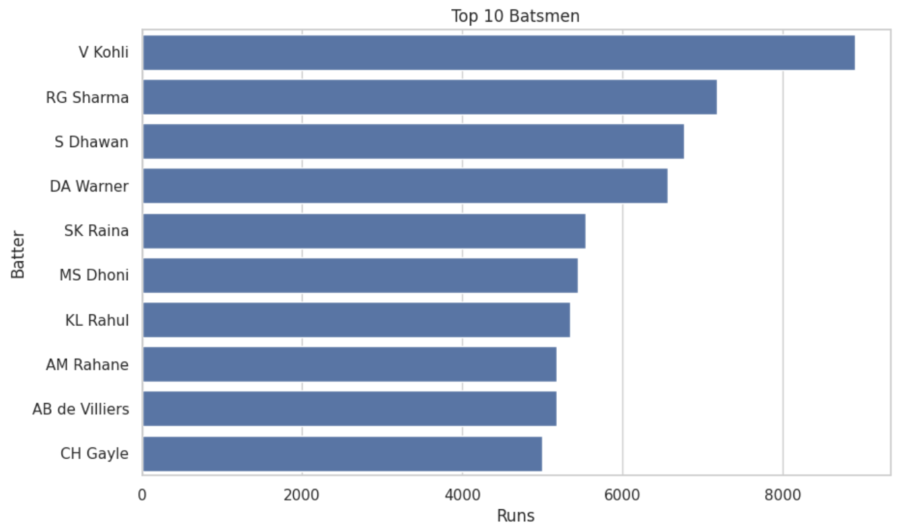
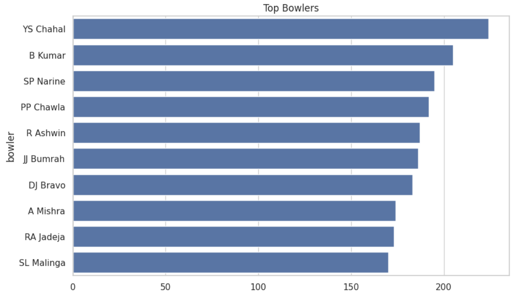
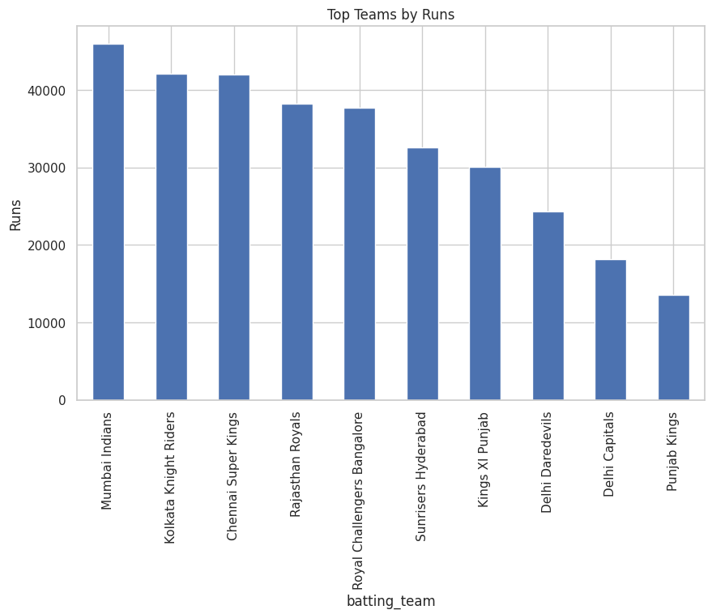
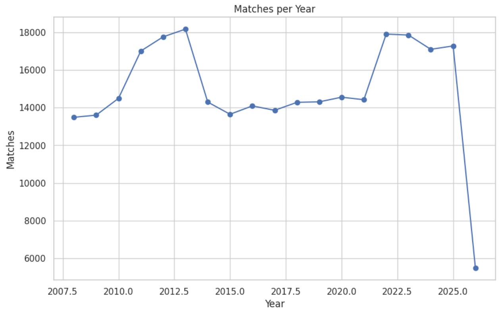
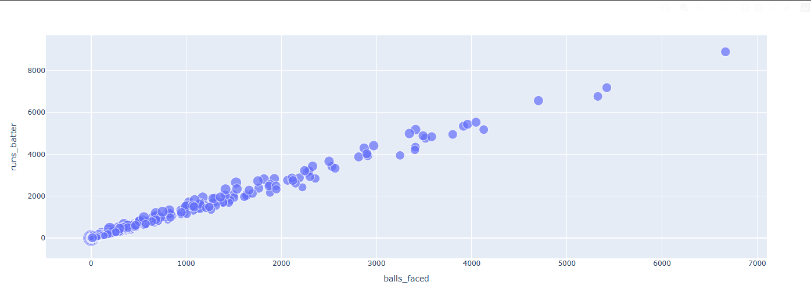

# 🏏 IPL Data Analysis Project


---

## 📌 Project Overview

This project analyzes IPL (Indian Premier League) ball-by-ball data using Python.

It focuses on:

* Data Cleaning
* Exploratory Data Analysis (EDA)
* Player Performance Analysis
* Team Performance Analysis
* Match Trends
* Data Visualization

---

## 📸 Project Preview

### Top Batsmen



### Top Bowlers



### Team Performance



### Year-wise Matches



### Run Distribution



---

## 🚀 Technologies Used

* Python
* Pandas
* NumPy
* Matplotlib
* Seaborn
* Plotly
* Google Colab

---

## 📂 Dataset Information

* IPL Ball-by-Ball Dataset
* Contains match, player, and performance data
* Sample dataset included due to GitHub size limits

---

## 📊 Analysis Performed

### Data Cleaning

* Removed unnecessary columns
* Handled missing values
* Converted date column

### Exploratory Data Analysis

* Top batsmen (total runs)
* Strike rate analysis
* Top bowlers (wickets)
* Team performance
* Most winning teams
* Year-wise matches
* Run distribution

---

## 💡 Key Insights

* Top batsmen contribute majority of total runs
* Certain teams consistently dominate matches
* High strike rate players are crucial in scoring
* Wicket-taking bowlers influence match outcomes
* Matches have increased over the years

---

## 🧠 Skills Demonstrated

* Data Cleaning
* Exploratory Data Analysis
* Data Visualization
* Sports Analytics
* Insight Generation
* Python Programming

---

## 📁 Project Structure

```
ipl-data-analysis/
│
├── sample_ipl_data.csv
├── cleaned_ipl_data.csv (optional)
├── notebook.ipynb
├── insights.txt
├── README.md
│
└── images/
    ├── batsmen.png
    ├── bowlers.png
    ├── teams.png
    ├── yearly.png
    └── distribution.png
```

---

## ▶️ How to Run

1. Open notebook in Google Colab
2. Upload dataset (or use sample file)
3. Run all cells
4. View outputs and graphs

---

## 📌 Future Improvements

* Add batting average
* Add bowler economy
* Build Streamlit dashboard
* Add ML model for prediction

---

## 👩‍💻 Author

**Komal Margale**
Data Analyst | Python Enthusiast

---

## ⭐ Support

If you like this project, give it a ⭐ on GitHub .
